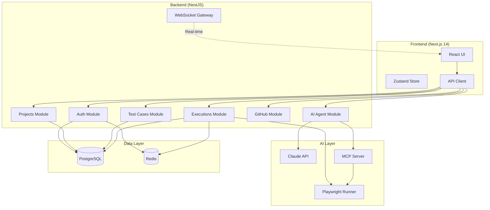
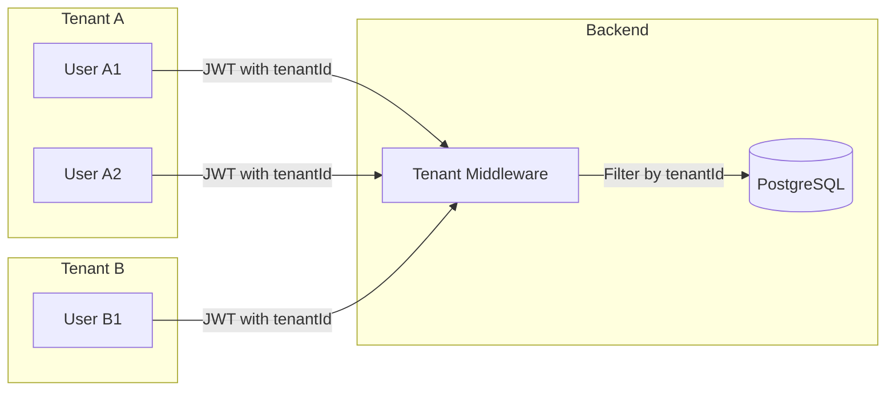
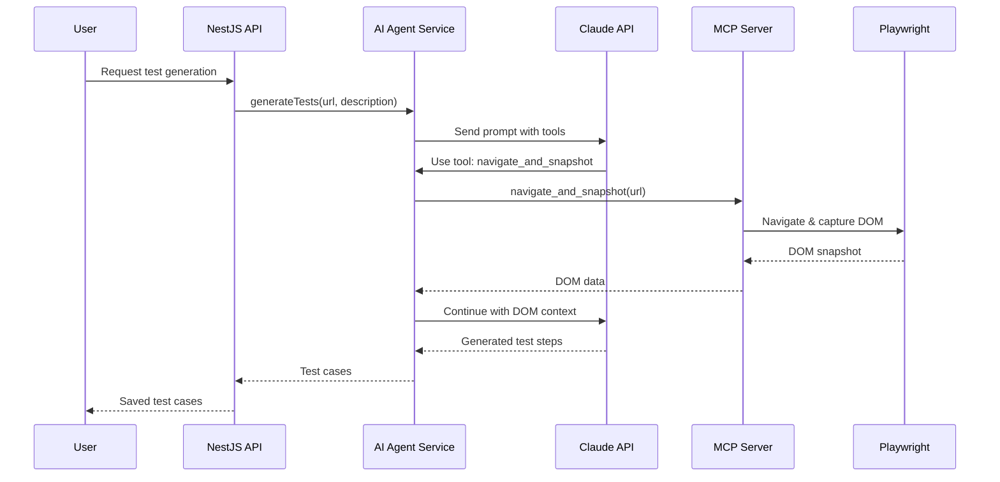

# QA Platform - SaaS Test Management

A full-stack SaaS platform for QA test management with AI-powered test generation, Playwright automation, multi-tenant architecture, and GitHub integration.

## Architecture



## Multi-Tenant Architecture



## AI Agent Flow



## Tech Stack

| Layer | Technology |
|-------|-----------|
| Frontend | Next.js 14, TypeScript, Tailwind CSS, shadcn/ui, Zustand |
| Backend | NestJS, TypeScript, TypeORM, JWT |
| Database | PostgreSQL 15, Redis 7 |
| AI | Claude API (anthropic SDK), MCP Server |
| Testing | Playwright |
| Deployment | Docker Compose, GitHub Actions, GitHub Pages |

## Quick Start

### Prerequisites
- Node.js 18+
- Docker & Docker Compose
- Anthropic API Key

### Local Development

```bash
# Clone the repository
git clone https://github.com/lrbg/QATestAutoBa3.git
cd QATestAutoBa3

# Install dependencies
npm install

# Configure environment
cp backend/.env.example backend/.env
cp frontend/.env.example frontend/.env.local

# Start infrastructure
docker-compose up -d postgres redis

# Start development servers
npm run dev
```

### Docker (Full Stack)

```bash
# Configure environment
cp backend/.env.example backend/.env
# Edit .env with your values

# Build and start all services
docker-compose up -d

# View logs
docker-compose logs -f
```

## Environment Variables

### Backend
| Variable | Description | Default |
|----------|-------------|---------|
| `DATABASE_URL` | PostgreSQL connection string | - |
| `REDIS_URL` | Redis connection string | - |
| `JWT_SECRET` | JWT signing secret | - |
| `ANTHROPIC_API_KEY` | Claude API key | - |
| `GITHUB_TOKEN` | GitHub personal access token | - |

### Frontend
| Variable | Description | Default |
|----------|-------------|---------|
| `NEXT_PUBLIC_API_URL` | Backend API URL | `http://localhost:3001` |
| `NEXT_PUBLIC_USE_MOCK` | Use mock data (for GitHub Pages) | `false` |

## GitHub Pages Demo

The frontend is deployed to GitHub Pages at `/QATestAutoBa3` with full mock data. No backend required for the demo.

Visit: https://lrbg.github.io/QATestAutoBa3

## API Reference

### Authentication
- `POST /auth/register` - Register new user
- `POST /auth/login` - Login and get JWT
- `GET /auth/profile` - Get current user

### Projects
- `GET /projects` - List tenant projects
- `POST /projects` - Create project
- `GET /projects/:id` - Get project
- `PUT /projects/:id` - Update project
- `DELETE /projects/:id` - Delete project

### Test Cases
- `GET /test-cases?projectId=:id` - List test cases
- `POST /test-cases` - Create test case
- `GET /test-cases/:id` - Get test case
- `PUT /test-cases/:id` - Update test case
- `DELETE /test-cases/:id` - Delete test case

### Executions
- `GET /executions?projectId=:id` - List executions
- `POST /executions` - Trigger execution
- `GET /executions/:id` - Get execution with results

### AI Agent
- `POST /ai-agent/generate-tests` - Generate tests from URL/description
- `POST /ai-agent/fix-test` - Fix failing test
- `POST /ai-agent/analyze` - Analyze test results
- `POST /ai-agent/chat` - Chat with AI agent (streaming)

### GitHub
- `POST /github/connect` - Connect GitHub repository
- `GET /github/branches` - List repository branches
- `POST /github/webhook` - GitHub webhook handler

## License

MIT
