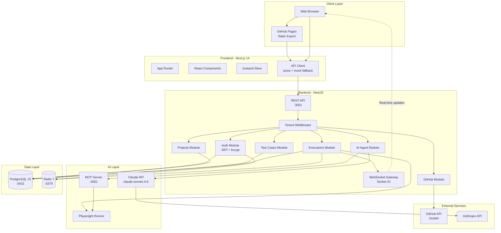
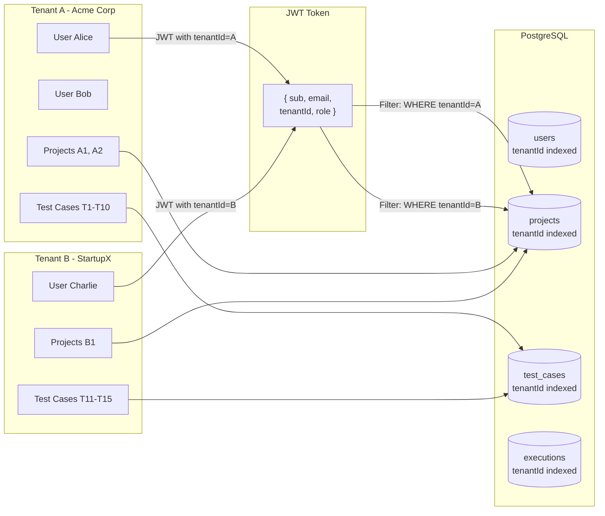
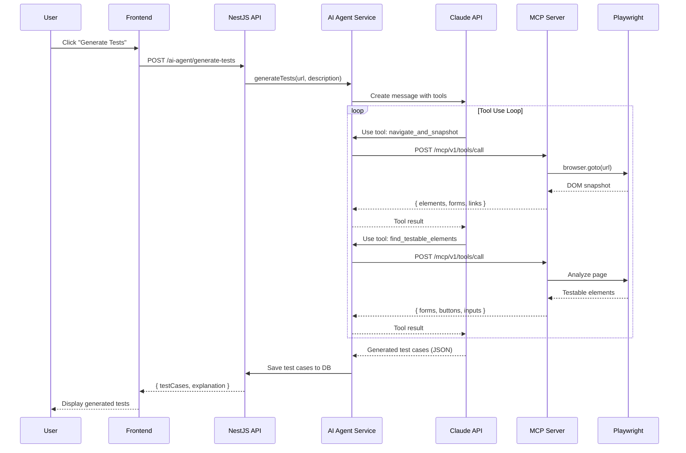
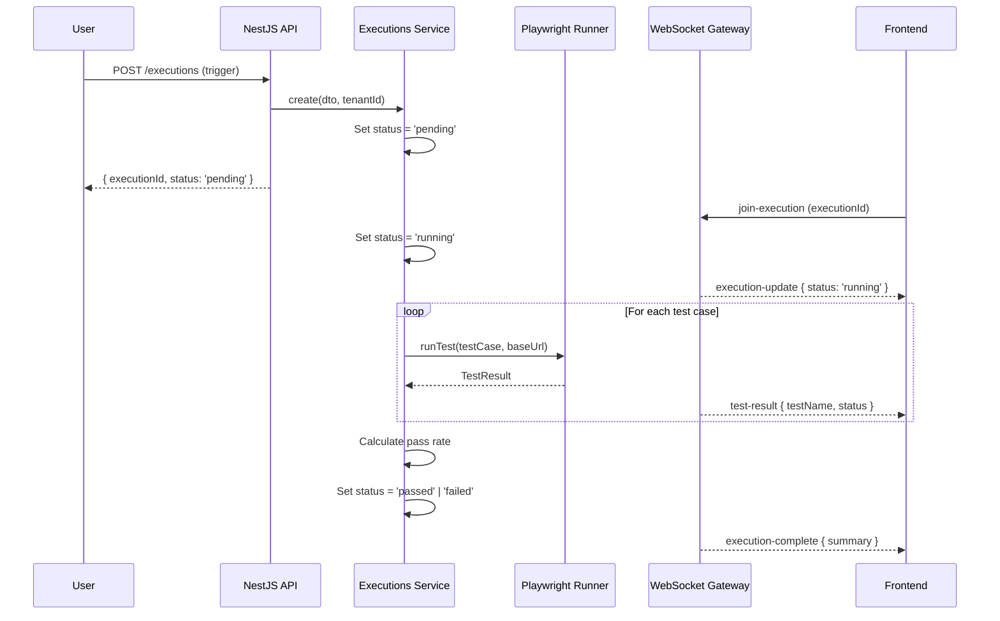
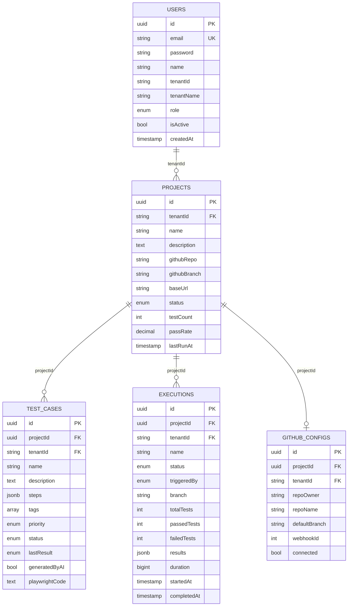
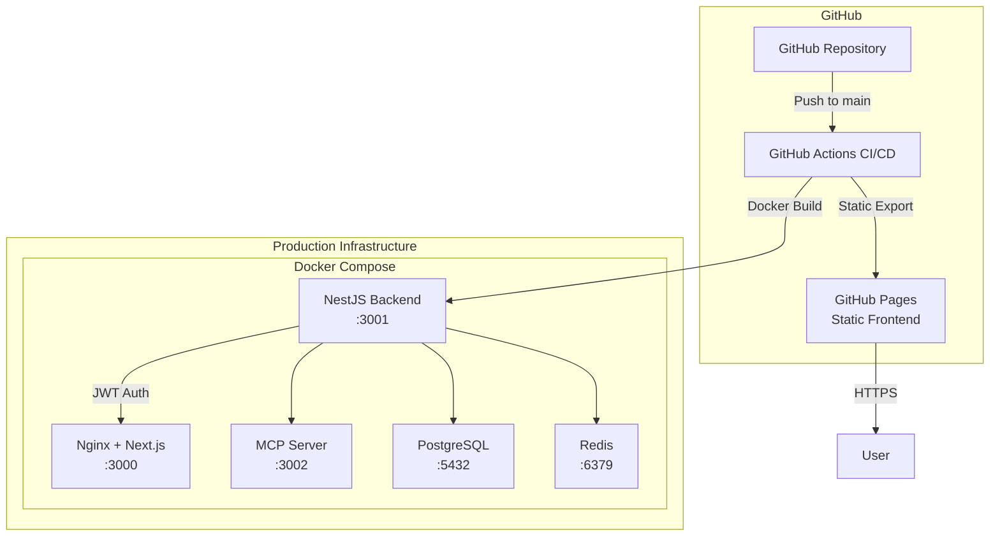
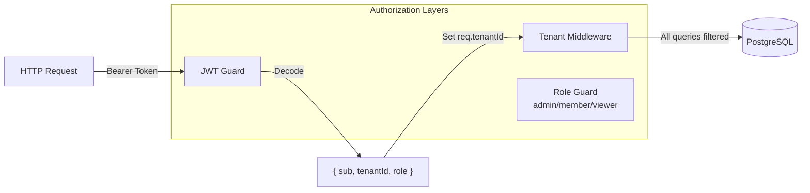

# QA Platform Architecture

## System Overview

The QA Platform is a multi-tenant SaaS application for automated test management with AI-powered test generation.

## High-Level Architecture

## Multi-Tenant Data Isolation

## AI Agent Flow

## Execution Flow

## Database Schema

## Deployment Architecture

## Security Model

## Technology Decisions

| Decision | Choice | Reasoning |
|----------|--------|-----------|
| Frontend framework | Next.js 14 App Router | Static export for GitHub Pages, server components for perf |
| State management | Zustand | Simple, TypeScript-first, minimal boilerplate |
| Backend framework | NestJS | Structured, TypeScript-native, dependency injection |
| ORM | TypeORM | PostgreSQL support, decorators, auto-sync in dev |
| Auth | JWT + bcrypt | Stateless, multi-tenant compatible |
| AI | Claude claude-sonnet-4-6 | Best in class for code generation and analysis |
| Browser automation | Playwright | Cross-browser, reliable selectors, TypeScript support |
| MCP | @modelcontextprotocol/sdk | Standard protocol for AI tool integration |
| Real-time | Socket.IO | Reliable WebSocket with fallbacks |
| Cache/Queues | Redis | Fast, reliable, supports pub/sub |
